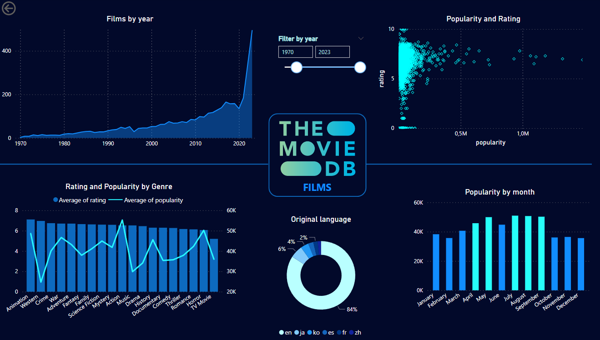
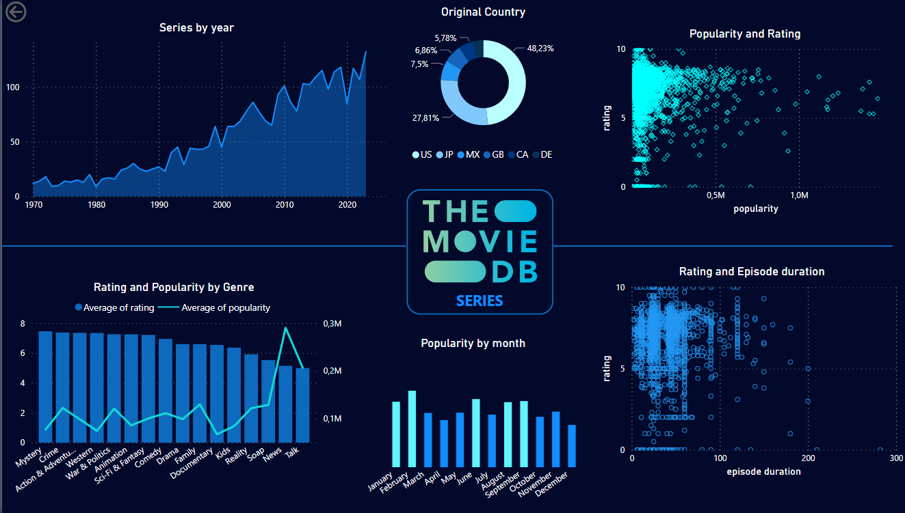

# Análisis Exploratorio de Datos (EDA) - Películas y Series

Este proyecto realiza un Análisis Exploratorio de Datos (EDA) sobre películas y series utilizando la API de The Movie Database (TMDb). El objetivo de este análisis es obtener información relevante sobre el contenido audiovisual disponible en la plataforma.

## Requisitos

El proyecto se ha desarrollado utilizando Python 3.7.4. Para instalar las librerías y dependencias requeridas, se puede utilizar el archivo requirements.txt. ejecutando el siguiente código en la terminal:

`pip install -r requirements.txt`

## Dashboards

Además de las visualizaciones y análisis en Python que se encuentran en el correspondiente Notebook se han realizado dos dashboards (uno para películas y otro para series) con la herramienta Power BI: 

